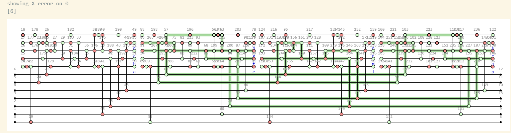
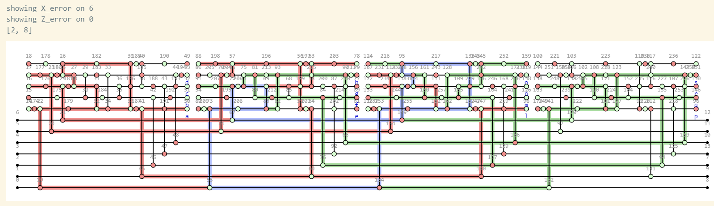
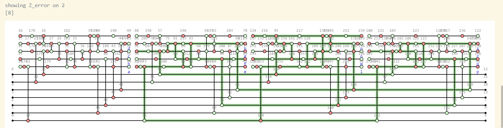
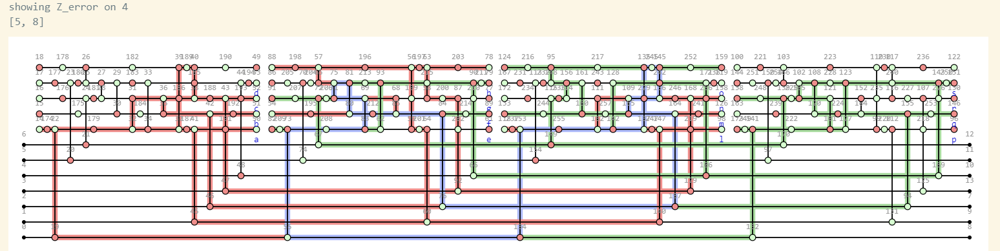
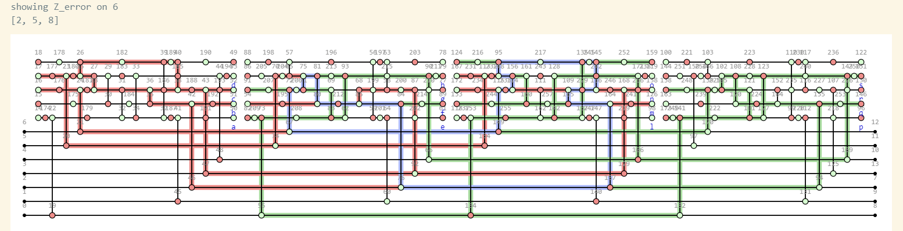
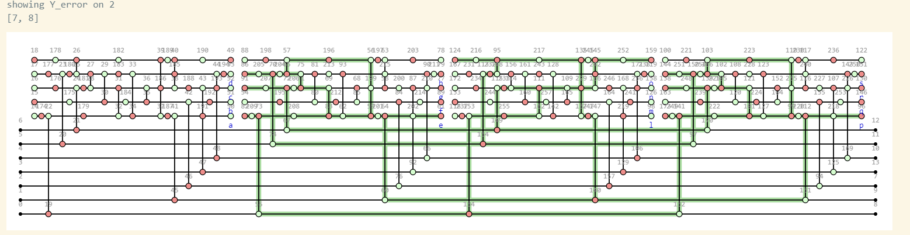

- Curious: Blue ones do indicate a Y error there, but they also have two edges going through the spot, 
 - and placing a Y error at the other edge does not produce the same triggered regions...
 - How do Y errors move through pauliwebs?
 - For that matter, refresh how X and Z errors move

# Oddities in triggered detection regions:
- X_error incorrectly triggering on 0

- X_error not triggering on 6, and Z error triggering incorrectly/ blue?

- Z on 2 triggering incorrect color

- Z on 4 incorrect color

- Z on 6 incorrect color (blue)

- Y on 2 incorrect triggering
